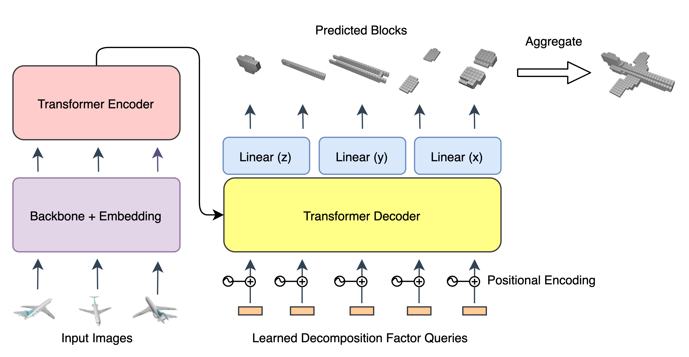

# LegoFormer

Source code for the paper [LegoFormer: Transformers for Block-by-Block Multi-view 3D Reconstruction](https://arxiv.org/abs/2106.12102).



### Setup

#### Dependency installation

Run `./install_dependencies.sh` to install the dependencies. 
You may want to create a virtual environment before you do so.

#### Dataset

[ShapeNet](https://www.shapenet.org/) dataset is used in the experiments. It consists of two parts - rendered images and ground truth voxel grids.
You can access the dataset as follows,

- Rendered images: http://cvgl.stanford.edu/data2/ShapeNetRendering.tgz
- GT voxel grids: http://cvgl.stanford.edu/data2/ShapeNetVox32.tgz

Please download and save them in any location you prefer. Don't forget to adjust the dataset path in the config file.

#### Pre-trained models

Pre-trained multi-view and single-view models can be found [here](https://legoformer.page.link/pretrained_models).
Please download and place them under the `checkpoints` directory.

### Usage

The `eval.py` can be used to evaluate the models on the `ShapeNet` dataset. The script takes three inputs -
path to the config file, path to the checkpoint and number of views.

Following command will evaluate the multi-view model on 4 input views from `ShapeNet`:

```markdown
python eval.py legoformer/config/legoformer_m.yaml checkpoints/legoformer_m.ckpt 4
```

Similar command to evaluate the single-view model will be:

```markdown
python eval.py legoformer/config/legoformer_s.yaml checkpoints/legoformer_s.ckpt 1
```

### Cite this work

```markdown
@misc{yagubbayli2021legoformer,
      title={LegoFormer: Transformers for Block-by-Block Multi-view 3D Reconstruction}, 
      author={Farid Yagubbayli and Alessio Tonioni and Federico Tombari},
      year={2021},
      eprint={2106.12102},
      archivePrefix={arXiv},
      primaryClass={cs.CV}
}
```
